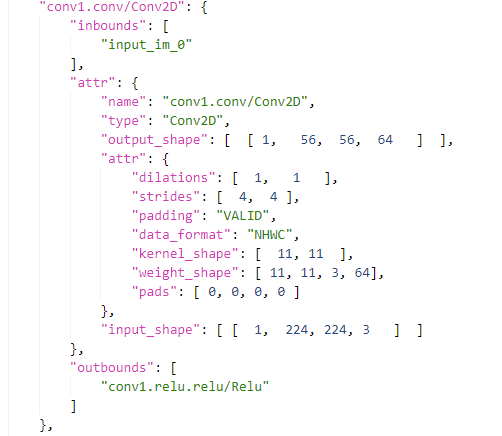

# Input Models

nn-Meter currently supports both a saved model file and the model object in code. In particular, we support saved models in .pb and .onnx formats, and we support to directly predict onnx and pytorch models. Besides, to support the hardware-aware NAS, nn-Meter can also predict the inference latency of models in [NNI graph](https://nni.readthedocs.io/en/stable/nas.html).

When taking the different model formats as input, nn-Meter converts them in nn-Meter IR graph. The kernel detection code will split the nn-Meter IR graph into the set of kernel units, and conduct kernel-level prediction.

### Input model as a saved file

You can save tensorflow models into frozen pb formats, and use the following nn-meter command to predict the latency:

```bash
# for Tensorflow (*.pb) file
nn-meter --predictor <hardware> --tensorflow <pb-file> 
```

For the other frameworks (e.g., Pytorch), you can convert the models into onnx models, and use the following nn-meter command to predict the latency:

```bash
# for ONNX (*.onnx) file
nn-meter --predictor <hardware> --onnx <onnx-file>
```

You can download the test [tensorflow models]("https://github.com/Lynazhang/nnmeter/releases/download/0.1/pb_models.zip") and [onnx models](https://github.com/Lynazhang/nnmeter/releases/download/0.1/onnx_models.zip). 

### Input model as a code object

You can also directly apply nn-Meter in your python code. In this case, please directly pass the onnx model and Pytorch model objects as the input model. The following is an example in Pytorch code:

```python
from nn_meter import load_latency_predictor

predictor = load_lat_predictor(hardware_name) # case insensitive in backend

# build your model here
model = ... # model is instance of torch.nn.Module

lat = predictor.predict(model,model_type='torch', input_shape=(3, 224, 224))
```

### <span id="nnmeter-ir-graph"> nn-Meter IR graph </span>

As introduced, nn-Meter will perform a pre-processing step to convert the above model formats into the nn-Meter IR graphs. Now we introduce the defined IR graph.

A *model* is consisting of *nodes*. The following is an example of conv *node*  of AlexNet model



For a *node*, we use the identical node name ("conv1.conv/Conv2D") as the node key. A *node* consists of:

* inbounds: a list of incoming node names
* outbounds: a list of outgoing node names. The inbounds and outbounds describe the node connections.
* attr: a set of attributes for the node. The attributes can be different for different types of NN node.

You can download the example nn-Meter IR graphs through [here](https://github.com/Lynazhang/nnmeter/releases/download/0.1/ir_graphs.zip).

When you have a large amount of models to predict, you can also convert them into nn-Meter IR graphs to save the pre-processing time:

```
# for Tensorflow (*.pb) file
nn-meter getir --tensorflow <pb-file> --output <output-name>

# for ONNX (*.onnx) file
nn-meter getir --onnx <onnx-file> --output <output-name>
```
