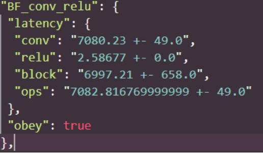

# Kernel Introduction

As introduced in Mobisys paper, we define a kernel is the maximum fusion unit in a model. The kernel is the basic scheduling unit in DNN inference on edge devices, it naturally captures the most important graph optimizations, i.e., the operator fusion.

The kernel detection algorithm takes: (i) the fusion rules on each hardware platform; and (ii) nn-meter ir graph as the inputs.

## Detected fusion rules

For every two operators, nn-Meter detects whether there is the operation fusion happened on the target hardware. To do so, nn-Meter designs a set of test cases and compare the latency difference (The code of operation fusion detection will be open-sourced in next release). The following is an example of conv and relu operators in the TFLite2.1 on the mobile CPU.

{"obey":"true"} indicates conv and relu can be fused into one fused operator.  We record all the fusion rules in a json file, you can find it in your local path: `~/.nn_meter/predictors/hardware_name/fusion_rules.json` after you download the targeting hardware predictors.

## Detected kernels

From the 26k benchmarked model dataset, we get different kernel units as the followings:

| hardware | kernels                                                                                                                                                                                                                                                                    |
| -------- | -------------------------------------------------------------------------------------------------------------------------------------------------------------------------------------------------------------------------------------------------------------------------- |
| CPU      | conv-relu,fc,maxpool,global-avgpool,fc-relu,concat,avgpool,conv-bn-relu,bn-relu,conv,SE-relu,conv-bn,dwconv-bn,dwconv-bn-relu,add,hswish,SE,conv-bn-bn-relu,relu,add-relu,channelshuffle,split                                                                             |
| GPUs     | conv-relu,fc,maxpool,global-avgpool,fc-relu,concat,avgpool,conv-bn-relu,bn-relu,conv,SE-relu,conv-bn,dwconv-bn,conv-bn-add,dwconv-bn-relu,hswish,SE,conv-bn-bn-relu,conv-bn-add-add-bn-relu,add-relu,relu,conv-bn-add-relu,conv-bn-add-bn-relu,add-add,conv-bn-add-add,add |
| VPU      | conv-relu,relu,fc,maxpool,global-avgpool,concat,avgpool,conv-bn-relu,bn,conv,SE-relu,conv-bn,dwconv-bn,dwconv-bn-relu,add,hswish,conv-bn-hswish,SE,conv-bn-bn-relu,add-relu,channelshuffle,split                                                                           |

## Kernel latency predictors

We apply the adaptive data sampling algorithm to sample data for building kernel latency predictors (The adaptive data sampling code will be released as soon as possible). The regression model is Random Forest.

Note: since the latency difference of conv-related kernels are negligible, we only build latency predictor for conv-bn-relu kernel to reduce the sampling and engineering efforts. And we use this kernel latency predictor to predict other conv-related kernels. For the same reason, we build latency predictor for dwconv-bn-relu kernel. Our experiment results demonstrate the effectiveness of this trick.

For each kernel latency predictor, we store them in .pkl format. You can find them in your local directory `~/.nn_meter/predictors/hardware_name/` after downloading it.
