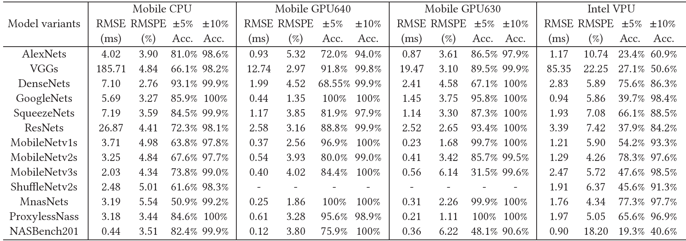

# Overview
Note: This is an alpha (preview) version which is still under refining.

nn-Meter is a novel and efficient system to accurately predict the inference latency of DNN models on diverse edge devices.

## Key Techniques
nn-Meter contains two key techniques: (i) kernel detection to automatically detect the execution unit of model inference via a set of well-designed test cases; (ii) adaptive sampling to efficiently sample the most beneficial configurations from a large space to build accurate kernel-level latency predictors.

nn-Meter currently supports multiple input model formats, please refer [input_models](input_models.md) for more details.

As discussed in nn-Meter paper, the approach is general to any DNN models on diverse edge devices. However, the current implementation considers the major CNN architectures on four types of hardware platforms. The following table shows the prediction performance of tested CNN model families on mobile CPU (i.e., *cortexA76cpu_tflite21*), mobile GPU 640 (i.e., *adreno640gpu_tflite21*), mobile GPU 630 (i.e., *adreno630gpu_tflite21*) and Intel VPU (i.e., *myriadvpu_openvino2019r2*).

If your DNN model structures are not included in above models, please read doc [ops](ops.md) and [kernels](kernel.md) to decide whether to build new latency predictor for them.

If you have a new hardware to predict DNN latency,  a re-run of nn-Meter is required to build latency predictors for the hardware. We will release the building tools very soon.

## Learn More
- [Get started](quick_start.md)

- [How to use nn-Meter Predictor](predictor/usage.md)

- [nn-meter in hardware-aware NAS](predictor/hardware-aware-model-design.md)