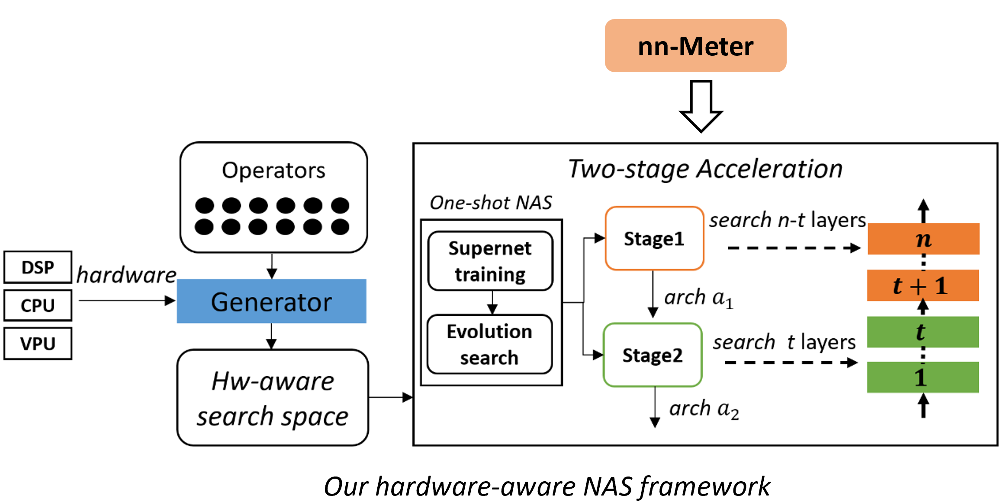

# Hardware-aware DNN Model Design

In many DNN model deployment scenarios, there are strict inference efficiency constraints as well as the model accuracy. For example, the **inference latency** and **energy consumption** are the most frequently used criteria of efficiencies to determine whether a DNN model could be deployed on a mobile phone or not. Therefore, DNN model designers have to consider the model efficiency. A typical methodology is to train a big model to meet the accuracy requirements first, and then apply model compression algorithms to get a light-weight model with similar accuracy but much smaller size. Due to many reasons, they use the number of parameters and FLOPs in the compression process.

However, as pointed out in our work [[1]](https://openaccess.thecvf.com/content_CVPRW_2020/papers/w40/Zhang_Fast_Hardware-Aware_Neural_Architecture_Search_CVPRW_2020_paper.pdf) and many others, ***neither number of parameters nor number of FLOPs is a good metric of the real inference efficiency (e.g., latency or energy consumption)***. Operators with similar FLOPs may have very different inference latency on different hardware platforms (e.g., CPU, GPU, and ASIC) (shown in work [[1]](https://openaccess.thecvf.com/content_CVPRW_2020/papers/w40/Zhang_Fast_Hardware-Aware_Neural_Architecture_Search_CVPRW_2020_paper.pdf) and [[3]](https://proceedings.mlsys.org/paper/2021/file/02522a2b2726fb0a03bb19f2d8d9524d-Paper.pdf)). This makes the effort of designing efficient DNN models for a target hardware bit of games of opening blind boxes. Recently, many hardware-aware NAS works are proposed to solve this challenge.

Compared with the conventional NAS algorithms, some recent works (i.e. hardware-aware NAS, aka HW-NAS) integrated hardware-awareness into the search loop and achieves a balanced trade-off between accuracy and hardware efficiencies [[4]](http://arxiv.org/abs/2101.09336).

Next, we introduce our hardware-aware NAS framework[[1]](https://openaccess.thecvf.com/content_CVPRW_2020/papers/w40/Zhang_Fast_Hardware-Aware_Neural_Architecture_Search_CVPRW_2020_paper.pdf), which combines the nn-Meter, to search high-accuracy DNN models within the latency constraints for target edge devices.

## Hardware-aware Neural Architecture Search

**Hardware-aware Search Space Generation.** As formulated in many works, the search space is one of the three key aspects of a NAS process (the other two are the search strategy and the evaluation methodology) and matters a lot to the final results.

Our HW-NAS framework firstly automatically selects the hardware-friendly operators (or blocks) by considering both representation capacity and hardware efficiency. The selected operators could establish a ***hardware-aware search space*** for most of existing NAS algorithms.

**Latency Prediction in search process by nn-Meter.** Different with other simple predictors (e.g., look-up table for operators/blocks, linear regression models), [nn-Meter](overview.md) conducts kernel-level prediction, which captures the complex model graph optimizations on edge devices. nn-Meter is the first accurate latency prediction tool for DNNs on edge devices.

Besides the search space specialization, our HW-NAS framework also allows combining nn-Meter with existing NAS algorithms in the optimization objectives and constraints. As described in [[4]](http://arxiv.org/abs/2101.09336), the HW-NAS algorithms often consider hardware efficiency metrics as the constraints of existing NAS formulation or part of the scalarized loss functions (e.g., the loss is weighted sum of both cross entropy loss and hardware-aware penalty). Since the NAS process may sample up to millions of candidate model architectures, the obtaining of hardware metrics must be accurate and efficient.

nn-Meter is now integrated with [NNI](https://github.com/microsoft/nni), the AutoML framework also published by Microsoft, and could be combined with existing NAS algorithms seamlessly. [This doc](https://nni.readthedocs.io/en/stable/NAS/HardwareAwareNAS.html#endtoend-multi-trial-spos-demo) show how to construct a latency constraint filter in [random search algorithm](https://arxiv.org/abs/1902.07638) on [SPOS NAS](https://www.ecva.net/papers/eccv_2020/papers_ECCV/papers/123610528.pdf) search space. Users could use this filter in multiple phases of the NAS process, e.g., the architecture searching phase and the super-net training phase. 

Another example is [ProxylessNAS](https://arxiv.org/pdf/1812.00332.pdf), a hardware-aware one-shot NAS algorithm. ProxylessNAS applies the expected latency of the model to build a differentiable metric and design efficient neural network architectures for hardware. The latency loss is added as a regularization term for architecture parameter optimization. The [official implementation](https://github.com/mit-han-lab/ProxylessNAS) of ProxylessNAS supports different targeted hardware, including 'mobile', 'cpu', 'gpu8', 'flops'. In the [current implementation](https://nni.readthedocs.io/en/stable/NAS/Proxylessnas.html) on NNI, users could use a latency estimator based on nn-Meter to predict expected latency for the mixed operation on other types of mobile and edge hardware. By using nn-Meter, please specifying the arguments of `--applied_hardware <hardware> --reference_latency <reference latency (ms)>` in the [example](https://github.com/microsoft/nni/blob/master/examples/nas/oneshot/proxylessnas/main.py).

***Note that current nn-Meter project is limited to the latency prediction. For the other hardware metrics, e.g., energy consumption is another important metric in edge computing. Collaborations and contributions together with nn-Meter are highly welcomed!***

## Other hardware-aware techniques

Besides light weighted NAS, which search for an efficient architecture directly, there are also other techniques to achieve light weight DNN models, such as model compression and knowledge distillation (KD). Both methods tries to get a smaller but similar-performed models from a pre-trained big model. The difference is that model compression removes some of the components in the origin model, while knowledge distillation constructs a new student model and lets it learn the behavior of the origin model. Hardware awareness could also be combined with these methods.
For example, nn-Meter could help users to construct suitable student architectures for the target hardware platform in the KD task.

## References

1. Li Lyna Zhang, Yuqing Yang, Yuhang Jiang, Wenwu Zhu, Yunxin Liu: [&#34;Fast hardware-aware neural architecture search.&#34;](https://openaccess.thecvf.com/content_CVPRW_2020/papers/w40/Zhang_Fast_Hardware-Aware_Neural_Architecture_Search_CVPRW_2020_paper.pdf) Proceedings of the IEEE/CVF Conference on Computer Vision and Pattern Recognition Workshops. 2020.
2. Li Lyna Zhang, Shihao Han, Jianyu Wei, Ningxin Zheng, Ting Cao, Yuqing Yang, Yunxin Liu: [&#34;nn-Meter: Towards Accurate Latency Prediction of Deep-Learning Model Inference on Diverse Edge Devices.&#34;](https://dl.acm.org/doi/10.1145/3458864.3467882) Proceedings of the 19th ACM International Conference on Mobile Systems, Applications, and Services (MobiSys 2021)
3. Xiaohu Tang, Shihao Han, Li Lyna Zhang, Ting Cao, Yunxin Liu: [&#34;To Bridge Neural Network Design and Real-World Performance: A Behaviour Study for Neural Networks&#34;](https://proceedings.mlsys.org/paper/2021/file/02522a2b2726fb0a03bb19f2d8d9524d-Paper.pdf) Proceedings of the 4th MLSys Conference (MLSys 2021)
4. Benmeziane, H., Maghraoui, K. el, Ouarnoughi, H., Niar, S., Wistuba, M., & Wang, N. (2021).[&#34; A Comprehensive Survey on Hardware-Aware Neural Architecture Search.&#34;](http://arxiv.org/abs/2101.09336)
